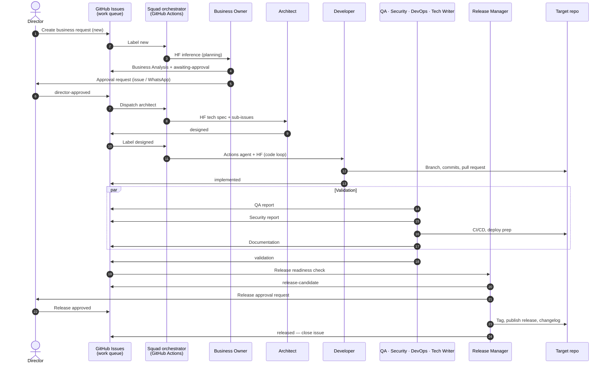

# ai-alpha-squad

Autonomous multi-agent software delivery squad. All documentation is under [.agents/](.agents/README.md).

## End-to-end cycle

Work is tracked on **GitHub Issues** (`ai-alpha-squad`); code ships from the **target repository**. Label flow: `new` → `awaiting-approval` → `director-approved` → `designed` → `implemented` → `validation` → `release-candidate` → `released`. Director-only approval: [director gate](docs/director-gate.md). **Pipeline board:** [Director project board](docs/director-project-board.md). Details: [issue lifecycle](.agents/issue-lifecycle.md).

| Resource | Path |
| -------- | ---- |
| Documentation index | [.agents/README.md](.agents/README.md) |
| Project specification | [.agents/project-specification.md](.agents/project-specification.md) |
| Orchestrator | [.agents/squad-orchestrator.md](.agents/squad-orchestrator.md) |
| Issue lifecycle | [.agents/issue-lifecycle.md](.agents/issue-lifecycle.md) |
| Definition of done | [.agents/definition-of-done.md](.agents/definition-of-done.md) |
| Artifact templates | [.agents/templates/README.md](.agents/templates/README.md) |
| Cursor / agent entry | [AGENTS.md](AGENTS.md) |
| Infrastructure setup | [.agents/infrastructure-prerequisites.md](.agents/infrastructure-prerequisites.md) |
| Cloud agent runtime | [.agents/agent-runtime-strategy.md](.agents/agent-runtime-strategy.md) |
| GAP vs squad (research) | [docs/gap-comparison.md](docs/gap-comparison.md) |

**Before the first job:** copy [.env.example](.env.example) → `.env`, then run `./scripts/verify-prerequisites.sh`. **Branch protection:** [docs/branch-protection.md](docs/branch-protection.md) · `./scripts/setup-branch-protection.sh`

**WhatsApp setup:** [docs/whatsapp-setup.md](docs/whatsapp-setup.md) · **Landing site:** [site/README.md](site/README.md) · `./scripts/deploy-landing.sh`

**Tests:** `python3 -m venv .venv && .venv/bin/pip install pytest && .venv/bin/pytest tests/ -q`

**Work queue:** [GitHub Issues](https://github.com/eduardocerqueira/ai-alpha-squad/issues)
