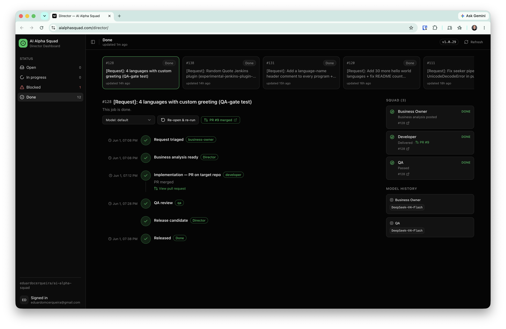
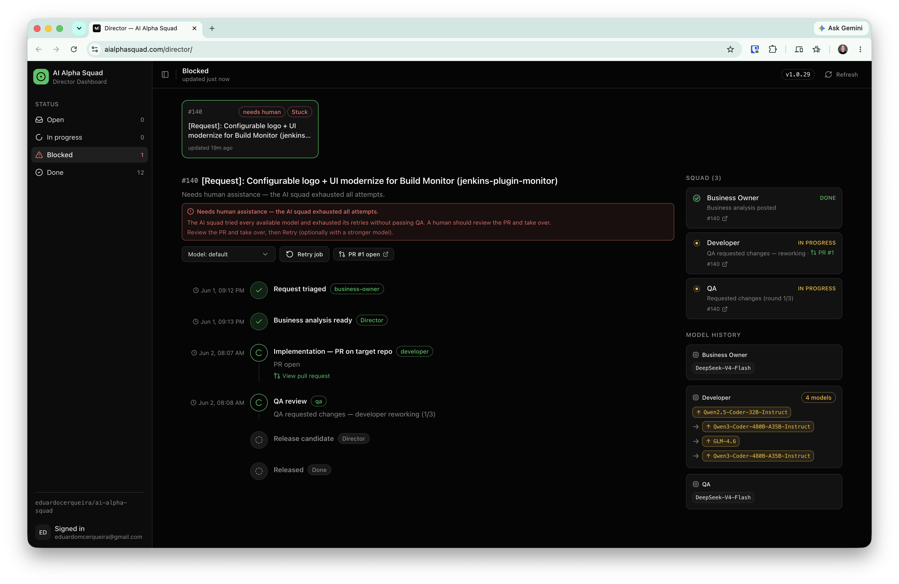
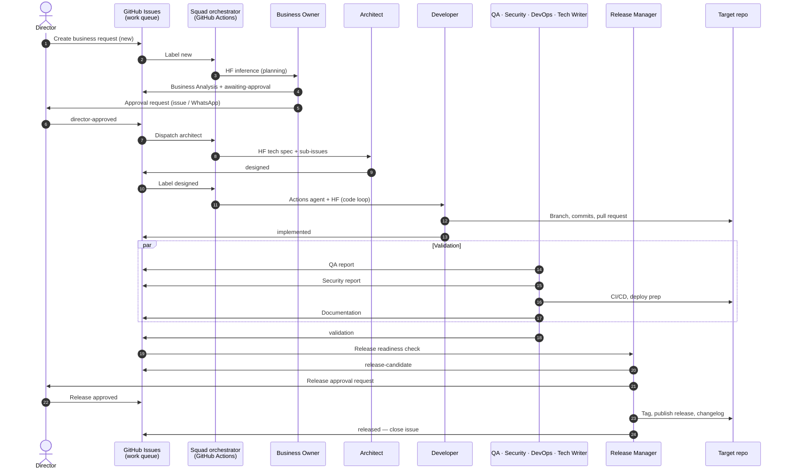

<div align="center">

# 🛰️ AI Alpha Squad

### Business requests in, working software out.

**An autonomous multi-agent software delivery squad.** Open a GitHub Issue describing what you want built — a team of specialized AI agents analyzes it, designs it, writes the code, tests it, security-reviews it, documents it, and opens a pull request on the target repo. A human Director approves the milestones that matter. Everything else runs itself.

[**🌐 aialphasquad.com**](https://aialphasquad.com) · [**📋 Open a request**](https://github.com/eduardocerqueira/ai-alpha-squad/issues/new/choose) · [**🖥️ Director Dashboard**](https://aialphasquad.com/director/) · [**📚 Docs**](.agents/README.md)

[](https://aialphasquad.com)
[](https://aialphasquad.com)
[](LICENSE)
[](#whats-under-the-hood)

<br/>

[](https://aialphasquad.com/director/)

<sup>**Director Dashboard** — the live control room: lifecycle timeline with timestamps, the squad working in real time, and each agent's AI-model history. [See it live →](https://aialphasquad.com/director/)</sup>

[](https://aialphasquad.com/director/)

<sup>A blocked job — Stop execution, model escalation history, and one-click Retry.</sup>

</div>

---

## What is this?

AI Alpha Squad is a working experiment in **autonomous software delivery**: a full engineering org reimagined as cooperating AI agents that operate entirely through GitHub. There's no chat window to babysit and no prompt-engineering ritual — you file an issue like you would with any team, and the squad takes it from idea to pull request.

It's deliberately **GitHub-native** (issues are the single source of truth), **human-governed** (one Director holds final approval), and **fully traceable** (every analysis, decision, test, and review is a comment or artifact on the issue). Built on open models via Hugging Face inference — no proprietary agent platform required.

> **Honest status:** this is an experimental research lab, not a finished product. It already ships real pull requests to real repos — and it has rough edges. That's the fun part. ⭐ Star it to follow along.

## See it in action

| | |
| --- | --- |
| 🌐 **Landing site** | [aialphasquad.com](https://aialphasquad.com) — what the squad is and how to reach it |
| 🖥️ **Director Dashboard** | [aialphasquad.com/director](https://aialphasquad.com/director/) — live view of every job: lifecycle timeline with timestamps, the squad working in real time, and which AI model each agent used (with escalation history) |
| 📋 **Submit a request** | [Open a GitHub Issue](https://github.com/eduardocerqueira/ai-alpha-squad/issues/new/choose) — the squad picks it up automatically |
| 🔌 **Automate it** | Drive the whole pipeline from your own systems via the [GitHub Issues REST API](https://docs.github.com/en/rest/issues) |

## How it works

A business request flows through eight specialized agents, with the Director gating only the decisions that need a human. Code ships from the **target repository**; work is tracked on **GitHub Issues**.



Lifecycle: `new` → `awaiting-approval` → `director-approved` → `designed` → `implemented` → `validation` → `release-candidate` → `released`. The Director only ever steps in at the two approval gates — see the [director gate](docs/director-gate.md).

## Meet the squad

Eight roles, each constrained to its domain and accountable for specific artifacts:

| Agent | What it does |
| ----- | ------------ |
| 🧭 **Business Owner** | Turns a raw request into a clear Business Analysis — scope, user stories, acceptance criteria, risks |
| 🏗️ **Architect** | Designs the technical solution and breaks the work into linked sub-issues |
| 💻 **Developer** | Writes the code and opens a pull request on the target repo |
| 🧪 **QA** | Reviews and tests against the acceptance criteria — pass/fail with evidence |
| 🔒 **Security** | Audits for OWASP risks, dependency vulnerabilities, and leaked secrets |
| ⚙️ **DevOps** | Sets up CI/CD, builds, and deployment automation |
| 📝 **Tech Writer** | Produces the docs that ship with the feature |
| 🚀 **Release Manager** | Runs the release checklist, changelog, and version, then asks the Director to ship |
| 👤 **Director** *(you)* | The only human — creates requests, approves analysis and releases, unblocks |

Full role definitions live in [`.agents/`](.agents/README.md).

## Why it's interesting

- **Autonomous end-to-end.** Analysis → architecture → code → QA → security → docs → release, with no human in the loop except at approval gates.
- **GitHub-native.** Issues are the work queue and the audit log. No new tool to learn — if you can file an issue, you can brief the squad.
- **Self-escalating models.** Agents start on a fast open model and escalate to stronger ones when QA pushes back — the [dashboard](https://aialphasquad.com/director/) shows the full model-and-retry history per agent.
- **Human-governed.** One Director, two approval gates, full veto. The squad is autonomous, not unsupervised.
- **Approve from anywhere.** Optional [WhatsApp channel](docs/whatsapp-setup.md) for fast approvals — every message mirrored back to the issue.
- **Open and self-hostable.** Runs on GitHub Actions + Hugging Face inference + Cloudflare Workers. MIT licensed.

## What's under the hood

| | |
| --- | --- |
| **Work queue & audit log** | GitHub Issues |
| **Orchestration** | GitHub Actions (`squad-*` workflows) |
| **Agent inference** | Hugging Face models (e.g. DeepSeek, Qwen) with automatic escalation |
| **Code execution** | GitHub Actions agent + Copilot |
| **Landing site & Director Dashboard** | Cloudflare Workers + React/Vite/[shadcn/ui](https://ui.shadcn.com) |

## Quickstart

Want to run your own squad? You'll need a GitHub repo, a Hugging Face token, and (for the site) a Cloudflare account.

```bash
# 1. Configure
cp .env.example .env            # fill in tokens (GitHub, Hugging Face, Cloudflare)
./scripts/verify-prerequisites.sh

# 2. Protect main so only the squad's reviewed PRs merge
./scripts/setup-branch-protection.sh   # see docs/branch-protection.md

# 3. Run the tests
python3 -m venv .venv && .venv/bin/pip install pytest && .venv/bin/pytest tests/ -q

# 4. Brief the squad — open a business request
#    → https://github.com/eduardocerqueira/ai-alpha-squad/issues/new/choose
```

**Director workflow:** `./scripts/squad-director-now.sh` lists what needs your approval and which jobs are stuck — or watch it all live on the [Director Dashboard](https://aialphasquad.com/director/). **WhatsApp approvals:** [docs/whatsapp-setup.md](docs/whatsapp-setup.md). **Landing site:** [site/README.md](site/README.md) · `./scripts/deploy-landing.sh`.

## Documentation

| Resource | Path |
| -------- | ---- |
| Documentation index | [.agents/README.md](.agents/README.md) |
| Project specification | [.agents/project-specification.md](.agents/project-specification.md) |
| Orchestrator (collaboration rules) | [.agents/squad-orchestrator.md](.agents/squad-orchestrator.md) |
| Issue lifecycle | [.agents/issue-lifecycle.md](.agents/issue-lifecycle.md) |
| Definition of done | [.agents/definition-of-done.md](.agents/definition-of-done.md) |
| Artifact templates | [.agents/templates/README.md](.agents/templates/README.md) |
| Director gate & dashboard | [docs/director-gate.md](docs/director-gate.md) · [docs/director-dashboard.md](docs/director-dashboard.md) |
| Cursor / agent entry | [AGENTS.md](AGENTS.md) |
| Infrastructure setup | [.agents/infrastructure-prerequisites.md](.agents/infrastructure-prerequisites.md) |
| Cloud agent runtime | [.agents/agent-runtime-strategy.md](.agents/agent-runtime-strategy.md) |
| GAP vs squad (research) | [docs/gap-comparison.md](docs/gap-comparison.md) |
| Job 1 retrospective | [docs/retrospectives/job-1-2026-06-01.md](docs/retrospectives/job-1-2026-06-01.md) |

---

<div align="center">

**Brief the squad → [open a request](https://github.com/eduardocerqueira/ai-alpha-squad/issues/new/choose)** · Watch it work → [Director Dashboard](https://aialphasquad.com/director/) · Like the idea? **★ star the repo.**

[aialphasquad.com](https://aialphasquad.com) · MIT licensed · An experimental autonomous-delivery lab

</div>
