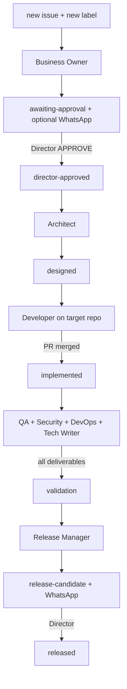

# Squad orchestrator automation

Goal: **end-to-end SDLC with minimal Director intervention** — agents start and hand off via GitHub Issues labels and phase watch workflows.

## Automated flow (full)



## Workflows

| Workflow | Trigger | Action |
| -------- | ------- | ------ |
| [squad-orchestrator.yml](../.github/workflows/squad-orchestrator.yml) | `issues: labeled`, `opened` | Dispatch Copilot agent for lifecycle label |
| [squad-phase-watch.yml](../.github/workflows/squad-phase-watch.yml) | schedule 15m, `repository_dispatch`, sub-issue closed, comments | Advance phases, sync labels, nudge stuck agents |
| [squad-copilot-pr-guard.yml](../.github/workflows/squad-copilot-pr-guard.yml) | Copilot PR opened | Close planning PRs; nudge agent or sync labels |
| [director-gate.yml](../.github/workflows/director-gate.yml) | `director-approved`, Director comments | Enforce approval gates |

## Orchestrator nudge (recovery)

When an agent stalls or Copilot opens a planning PR on `ai-alpha-squad` by mistake:

| Trigger | Action |
| ------- | ------ |
| PR guard closes a planning PR | **Immediate** re-dispatch of `business-owner` or `architect` (or label sync if deliverable already on issue) |
| Phase watch (15m) or issue comment | Scan stuck issues; re-dispatch after cooldown (default 30m, min age 15m) |
| `# Business Analysis` posted on issue | Auto-apply `awaiting-approval` (Director WhatsApp notify follows) |
| Tech spec + all sub-issues present | Auto-apply `designed` (Developer dispatch follows) |

Env overrides: `SQUAD_NUDGE_COOLDOWN_MINUTES`, `SQUAD_NUDGE_MIN_AGE_MINUTES`.

Scripts: `squad-nudge-stuck.sh`, `squad-sync-planning-labels.sh`.

## Label → action map

| Label added | Auto action | Copilot agent |
| ----------- | ----------- | ------------- |
| `new` | Dispatch | `business-owner` |
| `awaiting-approval` | Optional WhatsApp notify (GitHub comment `APPROVE` always works) | — |
| `director-approved` | Dispatch (Director gate) | `architect` |
| `designed` | Dispatch Developer sub-issue | `developer` on target repo |
| `implemented` | Dispatch validation sub-issues | `qa`, `security`, `devops`, `tech-writer` |
| `validation` | Dispatch | `release-manager` |
| `release-candidate` | Optional WhatsApp notify | — |

## WhatsApp (optional — does not block pipeline)

WhatsApp is a **convenience channel** for Director notifications. The squad pipeline runs on **GitHub Issues + labels** regardless.

| Mode | Behavior |
| ---- | -------- |
| `SQUAD_WHATSAPP_NOTIFY` unset (`auto`) | Send only when all `WHATSAPP_*` secrets/vars are set; otherwise skip silently |
| `SQUAD_WHATSAPP_NOTIFY=0` | Never send; no issue comments about failures |
| `SQUAD_WHATSAPP_NOTIFY=1` | Attempt send; log skip to Actions if misconfigured (still exit 0) |

Meta credential migration tracked in [ideas#1](https://github.com/eduardocerqueira/ideas/issues/1). Until fixed, approve on GitHub (`APPROVE` comment or `director-approve.sh`).

Orchestrator **never** posts “WhatsApp notify failed” on the issue — Copilot dispatch and label advances continue.

## Target repo hook (instant dev-merge detection)

Copy [target-repo-squad-notify.yml](../.agents/templates/target-repo-squad-notify.yml) to product repo as `.github/workflows/squad-notify-queue.yml`, or run:

```bash
./scripts/install-target-repo-orchestrator-hook.sh eduardocerqueira/seeker
```

Set on the **target repo**: `SQUAD_QUEUE_REPO=eduardocerqueira/ai-alpha-squad`, `SQUAD_ORCHESTRATOR_TOKEN` (PAT with `repo` + workflow dispatch on queue repo).

When a squad-linked PR merges, the queue repo receives `repository_dispatch` → immediate phase tick (no 15m wait).

## Director intervention only

| Gate | Why |
| ---- | --- |
| Business Analysis | `awaiting-approval` → APPROVE |
| Merge Developer PR | Production code |
| Approve Copilot CI (GitHub UI) | GitHub security policy on bot PRs |
| Release | `release-candidate` → final APPROVE |

## Scripts

| Script | Purpose |
| ------ | ------- |
| `squad-dispatch-copilot.sh` | Label → Copilot assign |
| `squad-dispatch-validation.sh` | Fan-out validation agents |
| `squad-advance-implemented.sh` | Dev PR merged → `implemented` |
| `squad-advance-validation.sh` | All validators done → `validation` |
| `squad-phase-tick.sh` | Run advance checks for active jobs |
| `squad-find-subissues.py` | Find sub-issues + deliverable checks |

## Secrets (queue repo)

| Secret / var | Purpose |
| ------------ | ------- |
| `SQUAD_ORCHESTRATOR_TOKEN` | PAT: issues, Copilot assign, workflow dispatch |
| `SQUAD_DIRECTOR_LOGIN` | Director gate |
| `SQUAD_WHATSAPP_NOTIFY` | Optional: `0` off, `1` on, unset = auto (send only if `WHATSAPP_*` configured) |
| `WHATSAPP_*` | Optional Director notifications (see [ideas#1](https://github.com/eduardocerqueira/ideas/issues/1)) |

## Related

- [squad-orchestrator.md](../.agents/squad-orchestrator.md)
- [issue-lifecycle.md](../.agents/issue-lifecycle.md)
- [agent-runtime-strategy.md](../.agents/agent-runtime-strategy.md)
