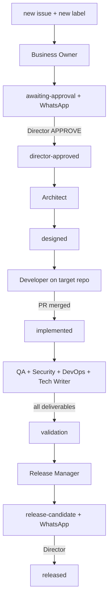

# Squad orchestrator automation

Goal: **end-to-end SDLC with minimal Director intervention** — agents start and hand off via GitHub Issues labels and phase watch workflows.

## Automated flow (full)



## Workflows

| Workflow | Trigger | Action |
| -------- | ------- | ------ |
| [squad-orchestrator.yml](../.github/workflows/squad-orchestrator.yml) | `issues: labeled`, `opened` | Dispatch Copilot agent for lifecycle label |
| [squad-phase-watch.yml](../.github/workflows/squad-phase-watch.yml) | schedule 15m, `repository_dispatch`, sub-issue closed, comments | Advance `designed`→`implemented`, `implemented`→`validation` |
| [director-gate.yml](../.github/workflows/director-gate.yml) | `director-approved`, Director comments | Enforce approval gates |

## Label → action map

| Label added | Auto action | Copilot agent |
| ----------- | ----------- | ------------- |
| `new` | Dispatch | `business-owner` |
| `awaiting-approval` | WhatsApp Director | — |
| `director-approved` | Dispatch (Director gate) | `architect` |
| `designed` | Dispatch Developer sub-issue | `developer` on target repo |
| `implemented` | Dispatch validation sub-issues | `qa`, `security`, `devops`, `tech-writer` |
| `validation` | Dispatch | `release-manager` |
| `release-candidate` | WhatsApp Director | — |

## Target repo hook (instant dev-merge detection)

Copy [target-repo-squad-notify.yml](../.agents/templates/target-repo-squad-notify.yml) to product repo as `.github/workflows/squad-notify-queue.yml`, or run:

```bash
./scripts/install-target-repo-orchestrator-hook.sh eduardocerqueira/seeker
```

Set on the **target repo**: `SQUAD_QUEUE_REPO=eduardocerqueira/ai-alpha-squad`, `SQUAD_ORCHESTRATOR_TOKEN` (PAT with `repo` + workflow dispatch on queue repo).

When a squad-linked PR merges, the queue repo receives `repository_dispatch` → immediate phase tick (no 15m wait).

## Director intervention only

| Gate | Why |
| ---- | --- |
| Business Analysis | `awaiting-approval` → APPROVE |
| Merge Developer PR | Production code |
| Approve Copilot CI (GitHub UI) | GitHub security policy on bot PRs |
| Release | `release-candidate` → final APPROVE |

## Scripts

| Script | Purpose |
| ------ | ------- |
| `squad-dispatch-copilot.sh` | Label → Copilot assign |
| `squad-dispatch-validation.sh` | Fan-out validation agents |
| `squad-advance-implemented.sh` | Dev PR merged → `implemented` |
| `squad-advance-validation.sh` | All validators done → `validation` |
| `squad-phase-tick.sh` | Run advance checks for active jobs |
| `squad-find-subissues.py` | Find sub-issues + deliverable checks |

## Secrets (queue repo)

| Secret / var | Purpose |
| ------------ | ------- |
| `SQUAD_ORCHESTRATOR_TOKEN` | PAT: issues, Copilot assign, workflow dispatch |
| `SQUAD_DIRECTOR_LOGIN` | Director gate |
| `WHATSAPP_*` | Director notifications |

## Related

- [squad-orchestrator.md](../.agents/squad-orchestrator.md)
- [issue-lifecycle.md](../.agents/issue-lifecycle.md)
- [agent-runtime-strategy.md](../.agents/agent-runtime-strategy.md)
