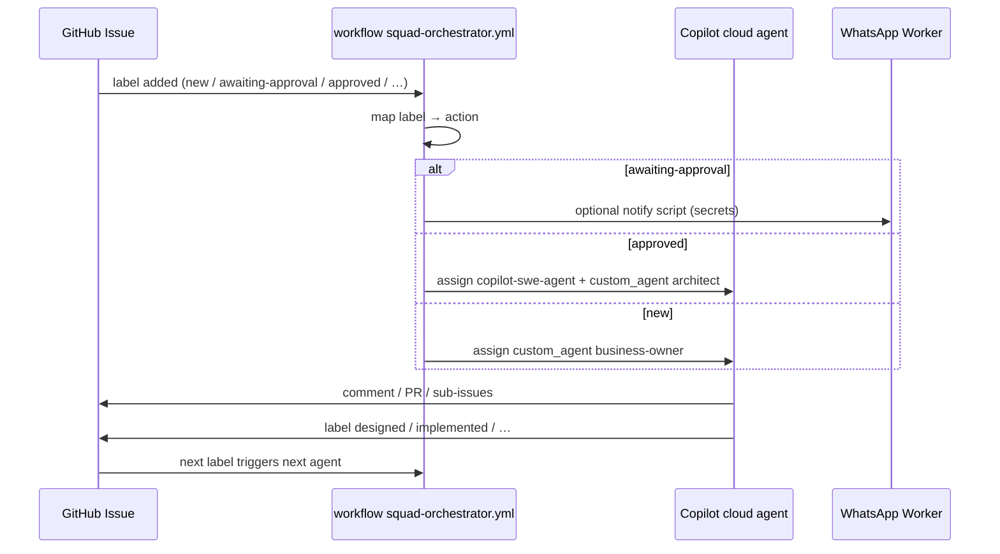

# Squad orchestrator automation

Goal: **agents start automatically and pass work** via GitHub Issues labels — like [AI-sandbox issue-bot](https://github.com/eduardocerqueira/AI-sandbox/blob/main/.github/workflows/issue-bot.yml) (`issues: labeled` → script), but using **AI Alpha Squad** lifecycle labels and **Copilot custom agents**.

## Problem today

| Event | Current behavior |
| ----- | ---------------- |
| Director adds `approved` | Label only; **Architect never starts** |
| Business Owner finishes | Manual `notify-director-awaiting-approval.sh` |
| Copilot session | Manual [Agents tab](https://github.com/eduardocerqueira/ai-alpha-squad/agents) |

[agent-runtime-strategy.md](../.agents/agent-runtime-strategy.md) Phase 2 called this out; it was deferred until WhatsApp/Worker existed.

## Recommended architecture (Phase 2)

### Core workflow

[`.github/workflows/squad-orchestrator.yml`](../.github/workflows/squad-orchestrator.yml) listens to:

- `issues: labeled` — hand off to the next agent
- `issues: opened` — if the issue has `new`, start Business Owner

Dispatcher: [`scripts/squad-dispatch-copilot.sh`](../scripts/squad-dispatch-copilot.sh)

Issue comments use line SVG avatars from [`assets/agents/`](../assets/agents/) via [`src/ai_alpha_squad/comments.py`](../src/ai_alpha_squad/comments.py) (or `scripts/format-squad-comment.py`).

### Label → action map

| Label added | Auto action | Copilot custom agent | Director gate |
| ----------- | ----------- | -------------------- | ------------- |
| `new` | Assign Copilot | `business-owner` | No |
| `awaiting-approval` | WhatsApp notify Director | — | **Yes** — wait for APPROVE |
| `approved` | Assign Copilot | `architect` | After Director approval |
| `designed` | Comment + link sub-issues | `developer` on **target repo** sub-issues | No |
| `release-candidate` | WhatsApp notify | `release-manager` pattern | **Yes** |

Workflow labels like `implemented` / `validation` can be added in Phase 2b (parallel QA/Security sub-issues).

### Why Copilot API (not only OpenAI scripts)

[AI-sandbox](https://github.com/eduardocerqueira/AI-sandbox) uses **Python + OpenAI + `gh`** in Actions. That works but ignores `.github/agents/*.agent.md` profiles.

For ai-alpha-squad, prefer:

1. **Assign issue to `copilot-swe-agent[bot]`** with `agent_assignment.custom_agent` — see [Copilot cloud agent API](https://docs.github.com/en/copilot/how-tos/use-copilot-agents/cloud-agent/use-cloud-agent-via-the-api).
2. Fallback: workflow comments “Assign Copilot agent X” if API/token fails.

### Why not Hugging Face for orchestration

HF Jobs / Spaces are for **GPU training, batch inference, datasets** — not GitHub issue state machines. Use HF when a **tech spec** requires it (see job skills on issue). Orchestration stays on **GitHub Actions + Copilot**.

## Secrets (repository)

| Secret | Purpose |
| ------ | ------- |
| `SQUAD_ORCHESTRATOR_TOKEN` | PAT or `github_app` with `issues: write`, Copilot agent assign (fine-grained: Issues + Copilot) |
| `OPENAI_API_KEY` | Optional fallback runner (Phase 2b) |
| `WHATSAPP_*` | For `awaiting-approval` / `release-candidate` notify step |
| `GITHUB_TOKEN` | Default; may lack Copilot assign — prefer dedicated token |

## Guards (avoid loops)

- Skip if `github.actor` is `github-actions[bot]` and label is orchestrator-internal.
- Skip assign if `copilot-swe-agent[bot]` already assigned.
- Concurrency: `squad-orchestrator-${{ github.event.issue.number }}`.

## Phase rollout

| Phase | Deliverable |
| ----- | ----------- |
| **2a (now)** | `squad-orchestrator.yml` + `squad-dispatch-copilot.sh` for `new`, `awaiting-approval`, `approved` |
| **2b** | Sub-issue dispatch on `designed` (target repo + issue number in body) |
| **2c** | Validation matrix (`implemented` → QA/Security/DevOps sub-issues) |
| **3** | Cloudflare Workflow durable orchestration + WhatsApp + GH (optional) |

## Manual override

Director can always assign Copilot from the UI. Automation is additive.

## Related

- [squad-orchestrator.md](../.agents/squad-orchestrator.md)
- [issue-lifecycle.md](../.agents/issue-lifecycle.md)
- [.github/SECRETS_AND_VARIABLES.md](../.github/SECRETS_AND_VARIABLES.md)
